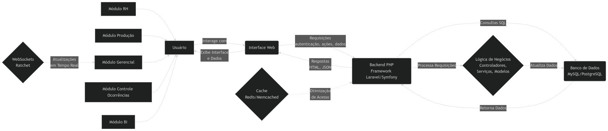

# Sistema de Controle de Produção CNC

Bem-vindo à documentação do Sistema de Controle de Produção de Cápsulas de Suplementos CNC.

## 📚 Documentação

- [📋 Requisitos do Sistema](requisitos.md)
- [📊 Casos de Uso](use_cases.md) 
- [📅 Cronograma de Implementação](cronograma.md)
- [🏗️ Diagramas](img/)

## 🔧 Infraestrutura

- [☁️ Configurações GCP](infra/gcp/)

## 📈 Diagramas

---

**Projeto desenvolvido com Django + React**