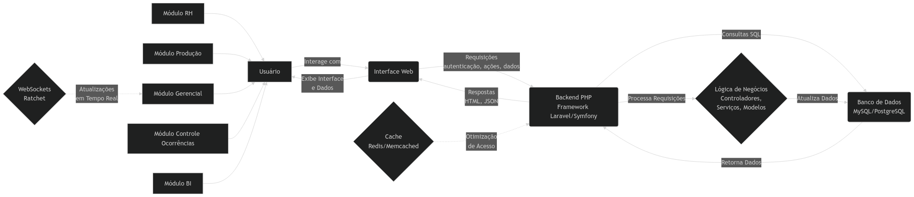
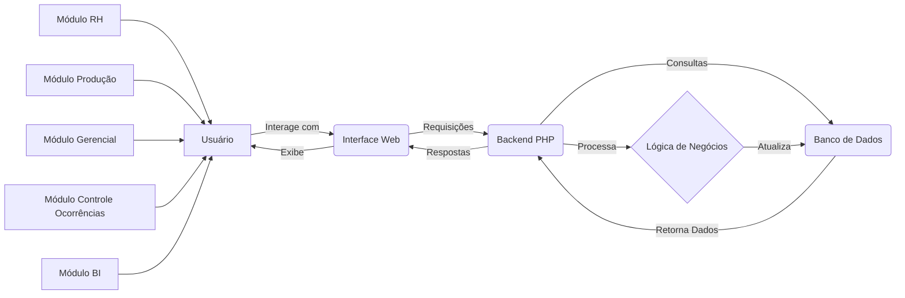
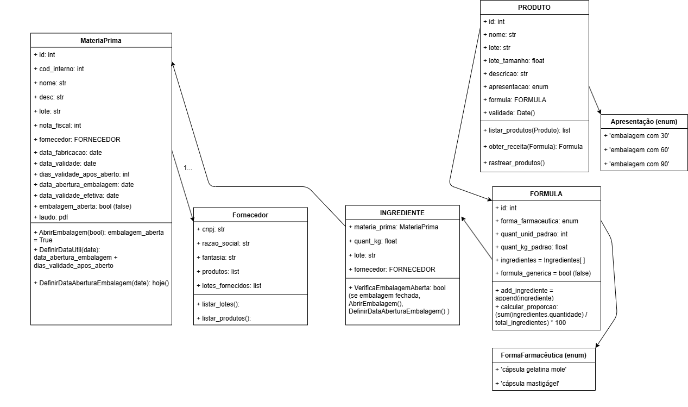
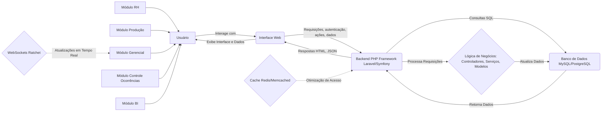

# Sistema de Controle de Produção de Cápsulas de Suplementos CNC

## Documento de Requisitos

### 1. Introdução

Este documento descreve os requisitos para um Sistema de Controle de Produção de Cápsulas de Suplementos CNC, projetado para gerenciar e monitorar o processo de produção de cápsulas em um ambiente de manufatura.

### 2. Objetivos

*   Automatizar o agendamento e o rastreamento da produção.
*   Fornecer visibilidade em tempo real do processo de produção.
*   Permitir o gerenciamento eficiente de recursos humanos, produção e ocorrências.
*   Gerar dados para análise de negócios e melhoria de processos.

### 3. Partes Interessadas

*   **RH:** Responsável pelo agendamento e gerenciamento de pessoal e cadastro de receitas.
*   **Produção:** Operadores e supervisores que executam o processo de produção.
*   **Gerencial:** Gerentes que supervisionam a produção e precisam de relatórios em tempo real (dashboards).
*   **Controle de Ocorrências:** Equipe responsável por lidar com problemas e ocorrências de produção.
*   **Analistas de BI:** Pessoal que analisa dados de produção para melhoria de negócios.

### 4. Requisitos Funcionais

#### 4.1. Módulo de RH

*   **4.1.1.** O sistema deve fornecer uma interface de tabela para o mês atual com as colunas 'data', 'responsáveis' e 'receitas'.
*   **4.1.2.** As receitas devem incluir o nome do produto e a quantidade de tanques.
*   **4.1.3.** As receitas podem ser modificadas até 12 horas antes da data programada.
*   **4.1.4.** Os tanques podem ser bloqueados até 1 hora antes do início programado.
*   **4.1.5.** O status da quantidade de tanques (disponível/bloqueado) deve ser exibido com indicadores visuais.
*   **4.1.6.** O bloqueio de um tanque deve bloquear automaticamente todos os tanques subsequentes.
*   **4.1.7.** O sistema deve solicitar uma observação ao bloquear tanques.
*   **4.1.8.** As observações de bloqueio devem ser exibidas na tela gerencial e para a equipe de produção.

#### 4.2. Módulo de Produção

*   **4.2.1.** O sistema deve exibir a programação diária de produção.
*   **4.2.2.** Cada dia deve apresentar um único processo de produção com etapas sequenciais:
    *   p1: Mistura
    *   p2: Estabilização (com cronômetro regressivo de 60 minutos)
    *   p3: Vácuo
    *   p4: Refrigeração
    *   p5: Liberação dos tanques
*   **4.2.3.** Cada etapa deve ter um checklist e campos para inserção de valores.
*   **4.2.4.** A progressão para a próxima etapa deve depender da conclusão do checklist e da entrada de valores.
*   **4.2.5.** O processo p2 deve ter um cronômetro regressivo de 60 minutos após o início. Informar dados de _viscosidade_
*   **4.2.6.** A liberação dos tanques (p5) deve exigir o início manual de cada tanque e a entrada de 'temperatura' e 'peso'.
*   **4.2.7.** O sistema deve registrar automaticamente os horários de início e fim de cada processo.
*   **4.2.8.** O RH pode bloquear a liberação dos tanques até 1 hora antes do início programado.
*   **4.2.9.** O sistema deve exibir uma mensagem de bloqueio com a observação do RH ao tentar liberar um tanque bloqueado.
*   **4.2.10.** Após a conclusão, o sistema deve exibir um 'dashboard' filtrado para o usuário.

#### 4.3. Módulo de Controle de Produção

*   **4.3.1.** Os usuários só podem visualizar as receitas atribuídas a eles.
*   **4.3.2.** Um modal acessível (ícone de tubo de ensaio) para inserção de parâmetros com abas para 'regulagens', 'carga' e 'resultados'.
    *   **Regulagens:** Tabela para entrada de dados de início/meio/fim para Cunha, Geladeira, Motor, Roda, Dragnet.
    *   **Carga:** Campos para 'Peso Gelatina (mg)', 'Peso Bruto', 'Peso Medicina'.
    *   **Resultados:** Campos para 'Total Gelatina', 'Total Medicina', 'Perdas (Aparas)', 'Perda Cápsulas'.
*   **4.3.3.** Uma área de resultados (ícone de gráfico de barras) exibindo os dados totais do dia e as médias de peso bruto e peso medicina.

#### 4.4. Módulo Gerencial

*   **4.4.1.** O sistema deve exibir uma linha do tempo para todos os usuários, mostrando o status atual do processo e os horários de início/fim previstos.
*   **4.4.2.** Um filtro deve permitir a exibição de todos os usuários ou usuários selecionados.
*   **4.4.3.** As observações inseridas pelos usuários devem ser exibidas em uma lista rolável.
*   **4.4.4.** Um ícone (!) deve indicar ocorrências na linha do tempo do usuário até que sejam resolvidas pelo RH.
*   **4.4.5.** As observações do RH sobre as ocorrências resolvidas devem ser adicionadas à área de observações.
*   **4.4.6.** As observações devem ser ordenadas por data de criação (mais recentes primeiro).
*   **4.4.7.** A tela gerencial deve ser acessível apenas para usuários autorizados.
*   **4.4.8.** A tela gerencial deve mostrar apenas os dados da data atual.

#### 4.5. Módulo de Controle de Ocorrências

*   **4.5.1.** Um ícone (!) deve permitir que os usuários criem ocorrências a qualquer momento.
*   **4.5.2.** As ocorrências devem ter campos obrigatórios para 'título', 'descrição' e até 3 anexos de imagem.
*   **4.5.3.** As ocorrências concluídas não podem ser editadas.
*   **4.5.4.** Após a criação da ocorrência, o sistema deve retornar à tela do processo anterior.

#### 4.6. Módulo de BI e Analytics

*   **4.6.1.** O sistema deve fornecer um dashboard com visualizações de dados.
*   **4.6.2.** O dashboard deve incluir filtros de data inicial e final (padrão para o mês atual).
*   **4.6.3.** Os gráficos devem ser interativos e permitir a navegação granular.
*   **4.6.4.** Deve haver links para listas de todas as observações e ocorrências dentro do período selecionado.
*   **4.6.5.** O módulo de BI deve ser acessível apenas para usuários autorizados.

### 5. Requisitos Não Funcionais

*   **5.1.** O sistema deve ser baseado na web e acessível em uma rede local.
*   **5.2.** O sistema deve ser construído usando PHP e um framework como Laravel ou Symfony.
*   **5.3.** As telas de produção devem ter ícones e fontes grandes para facilitar o uso com luvas.
*   **5.4.** A tela gerencial deve ser projetada para telas grandes.
*   **5.5.** A tela gerencial deve ser atualizada a cada 5 minutos (ou um intervalo configurável).
*   **5.6.** Todas as telas devem usar HTML semântico, CSS e Bootstrap.
*   **5.7.** O sistema deve ser seguro e proteger dados confidenciais.
*   **5.8.** O sistema deve ter um bom desempenho e responder rapidamente às interações do usuário.

### 6. Diagrama de Fluxo de Dados






### Diagrama de classes




## Sugestões

### Diagramas

#### Diagrama de Classes

```python
#classDiagram
    class Receita {
        +id : int
        +nome_produto : string
        +quantidade_tanques : int
        +data : date
    }
    class Tanque {
        +id : int
        +status : enum(disponivel, bloqueado)
        +observacao : text
        +receita_id : int
    }
    class Processo {
        +id : int
        +tipo : enum(mistura, estabilizacao, vacuo, refrigeracao, liberacao)
        +data_inicio : datetime
        +data_fim : datetime
        +usuario_id : int
        +receita_id : int
    }

    class ChecklistItem {
        +id: int
        +descricao: string
        +processo_id: int
    }
    class ChecklistValor {
        +id: int
        +valor: string
        +processo_id: int
    }

    class ProcessoTanque {
        +id : int
        +tanque_id : int
        +processo_id : int
        +temperatura : float
        +peso : float
        +data_inicio : datetime
        +data_fim : datetime
    }
    class Usuario {
        +id : int
        +nome : string
        +funcao : enum(rh, producao, gerencial, bi)
        +senha : string
    }
    class Ocorrencia {
        +id : int
        +titulo : string
        +descricao : text
        +data_criacao : datetime
        +usuario_id : int
        +status : enum(aberta, resolvida)
    }
    class OcorrenciaAnexo {
        +id : int
        +ocorrencia_id : int
        +caminho_arquivo : string
    }
    class Regulagem {
        +id: int
        +nome: enum(cunha, geladeira, motor, roda, dragnet)
        +inicio: string
        +meio: string
        +fim: string
    }

    class Carga {
        +id: int
        +peso_gelatina: float
        +peso_bruto: float
        +peso_medicina: float
    }

    class Resultado {
        +id: int
        +total_gelatina: float
        +total_medicina: float
        +perdas_aparas: float
        +perda_capsulas: float
    }
    Receita "1" -- "*" Tanque
    Usuario "1" -- "*" Processo
    Receita "1" -- "*" Processo
    Processo "1" -- "*" ChecklistItem
    Processo "1" -- "*" ChecklistValor
    Processo "1" -- "*" ProcessoTanque
    Tanque "1" -- "*" ProcessoTanque
    Ocorrencia "1" -- "*" OcorrenciaAnexo
    Usuario "1" -- "*" Ocorrencia

```

#### Diagrama de fluxo




### Tecnologias

*   **Backend:** PHP (Laravel + Doctrine ou Symfony | Django REST Framework 
*   **Frontend:**  React, Vue ou Angular
*   **Banco de Dados:** PostgreSQL para produção e MySQL ou SQLite pra dev
*   **Tempo Real:**  WebSockets (ex. Ratchet (PHP)) para atualizações em tempo real na tela gerencial, você pode usar
*   **Cache:** Considerar cache com Redis ou Memcached para melhorar o desempenho

### Melhorias de UI/UX

*   **Responsivo:** Todas as telas devem ser responsivas
*   **Cores:** Usar cores de forma consistente e significativa. (vermelho para erros ou bloqueios, amarelo para avisos e verde para sucesso)
*   **Fontes:** Usar fontes grandes e legíveis, especialmente para as telas de produção.
*   **Ícones:** Usar ícones intuitivos e universalmente reconhecidos

### Considerações de Segurança

*   **Autenticação:** Considerar usar bibliotecas como `password_hash` e `password_verify` do PHP para hash de senhas.
*   **Autorização:** Definir claramente as funções do usuário (RH, Produção, Gerencial, BI) e implementar controle de acesso baseado em função.
*   **Validação de Dados:** Validar os dados no lado do servidor para evitar entradas maliciosas/incorretas.
*   **Senhas:** Armazenar senhas com segurança. Considerar salt e troca de senha programada.

### Melhorias de Recursos

*   **Logs:** criar sistema de log abrangente para rastrear atividades do usuário, erros e alterações do sistema. Considerar Monolog.
*   **Relatórios:** Para a seção de BI, usar Chart.js ou D3.js para visualizações interativas.
*   **Notificações:** Considerar adicionar um sistema de notificação ou alarmes (ex.: e-mail, SMS, ligação, whatsapp, buzina, etc) para alertas críticos, como bloqueios de produção ou ocorrências graves.

### Infraestrutura

*   **Servidor:** Para uma rede local, um servidor robusto deve ser suficiente (estimar recursos após o beta)
*   **Backups:** backups regulares do banco de dados e do código do aplicativo.
*   **Versionamento:** uso do git hub, preferencialmente com _continuous integration_
*   **Ambiente de Teste:** ambiente de teste separado para testar novos recursos e atualizações antes da implantação em produção.
